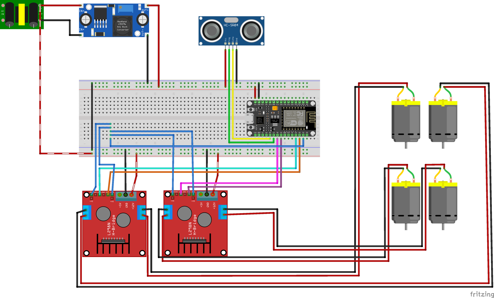
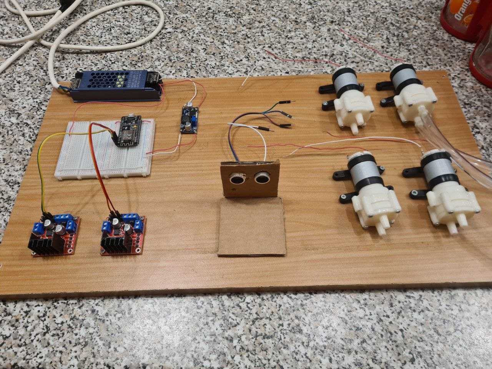
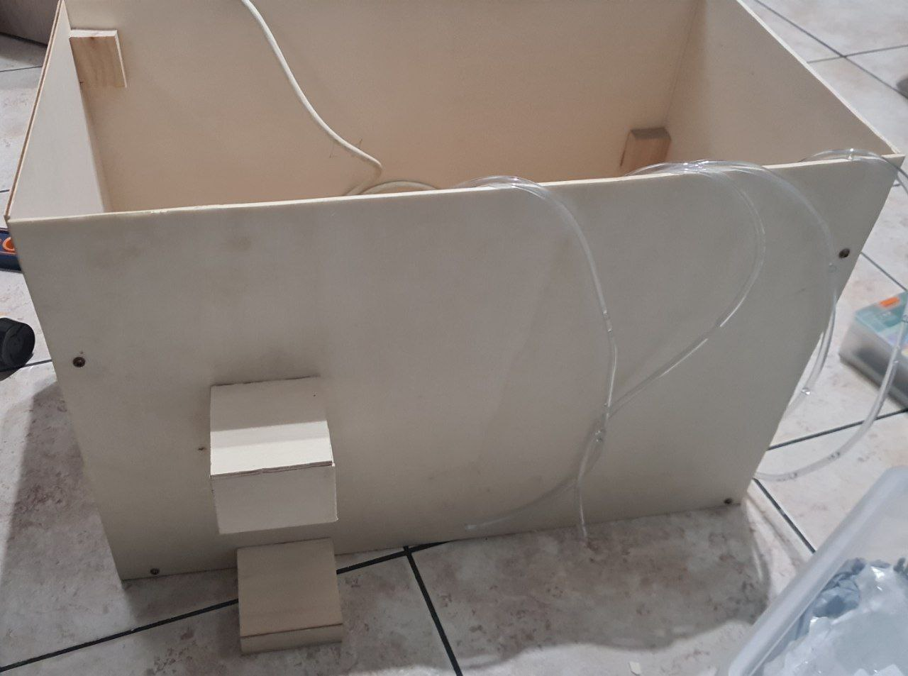
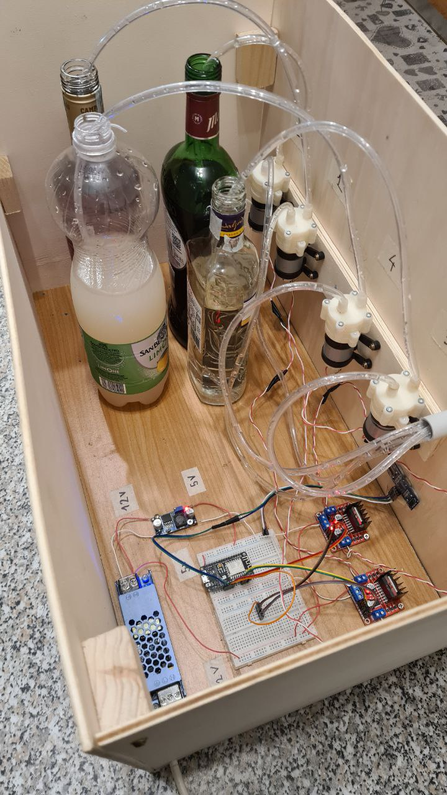
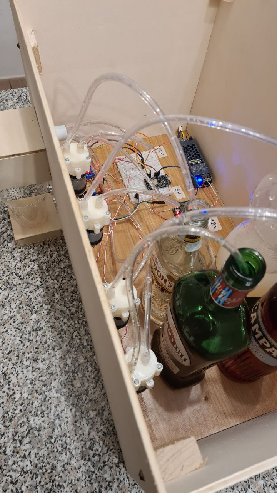
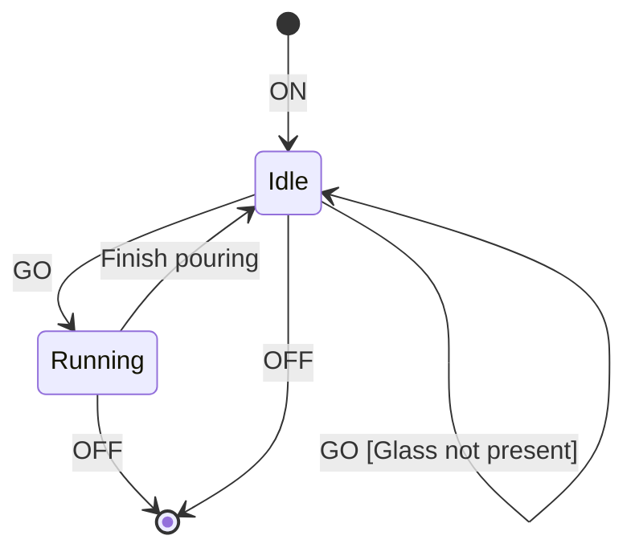

# SmartDrinks

Autore: Alessandro Bordonali

## Introduzione:

Smart Drinks è un progetto basato su ESP8266 progettato per automatizzare la preparazione di drink, miscelando gli ingredienti e prevenendo l'avvio del dispositivo in assenza di un bicchiere.

## Componenti Hardware:

- 1 x ESP8266: Modulo principale per la connettività, consente il controllo del dispositivo tramite EspHome e HomeAssistant.
- 4 x Pompe a Diaframma: Modello R285 12V, dosano con precisione gli ingredienti.
- 2 x L298N: Per controllare le pompe.
- 1 x HC-SR04: Utilizzato per il rilevamento della presenza del bicchiere.
- 1 x Alimentatore 12V: Fornisce l'energia necessaria all'intero sistema.
- 1 x LM2596: Regolatore di tensione per una alimentare l'esp.

## Schema Elettrico

## Aspetti Software:

Il progetto è sviluppato con esphome, facilitando l'integrazione con HomeAssistant e consentendo il controllo del dispositivo tramite smartphone.

## Progettazione e Sviluppo:

Il progetto ha avuto inizio come un prototipo su breadboard. I componenti, inizialmente sparsi, sono stati sistemati su una tavola di legno, successivamente circondata da altre pareti di legno. La base per il bicchiere e i tubi è stata costruita manualmente, e due fori sono stati praticati per ospitare il sensore ultrasonico.

## Foto

## Sfide e Soluzioni:

Durante lo sviluppo, sono state affrontate diverse sfide, come la gestione dello stato iniziale dei pin dell'ESP8266 durante l'avvio, e la precisione nella dispensazione di liquidi senza l'ausilio di un flussometro.
Lo stato di molti pin all'avvio della mia board non rispettava la documentazione fornita dal produttore; la soluzione trovata è stato usare i pin di abilitazione dei ponti H per abilitare le pompe, ma solamente dopo aver finito la fase di boot del MCU.
Ho notato che per piccole quantità di liquido le pompe erano precise (es. 10ml), mentre per grandi quantità (es. 40ml) la precisione diminuiva; la soluzione che ho trovato è stata suddividere in dosi più piccole l'erogazione dell'ingrediente.

## State Diagram

